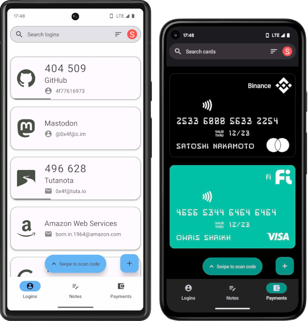
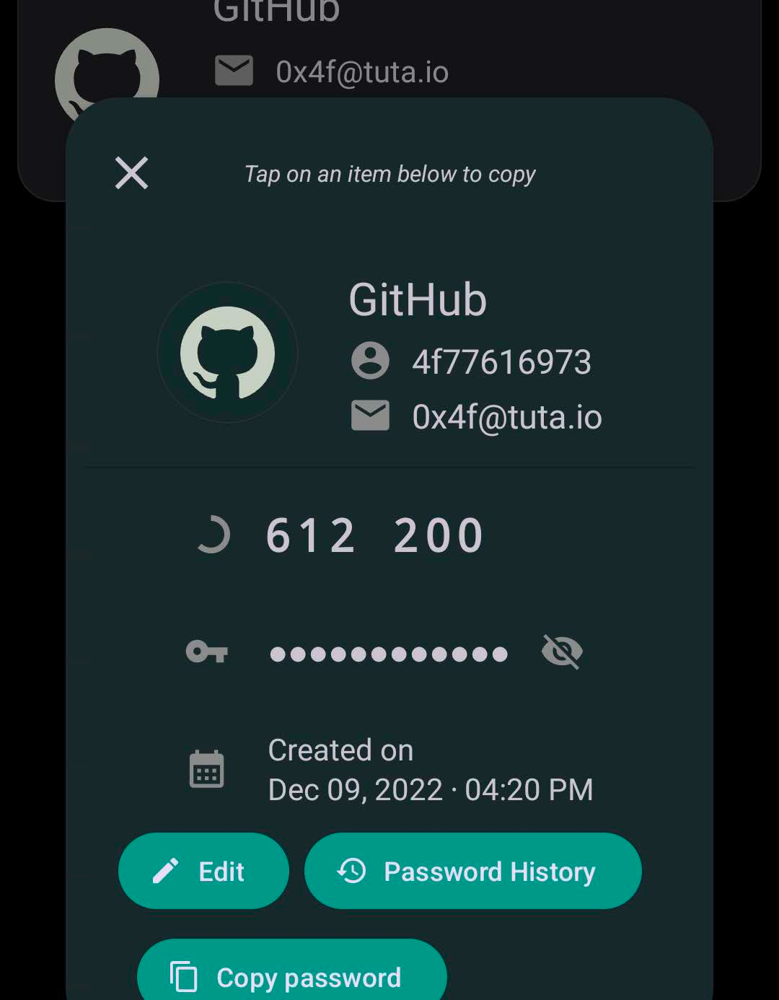
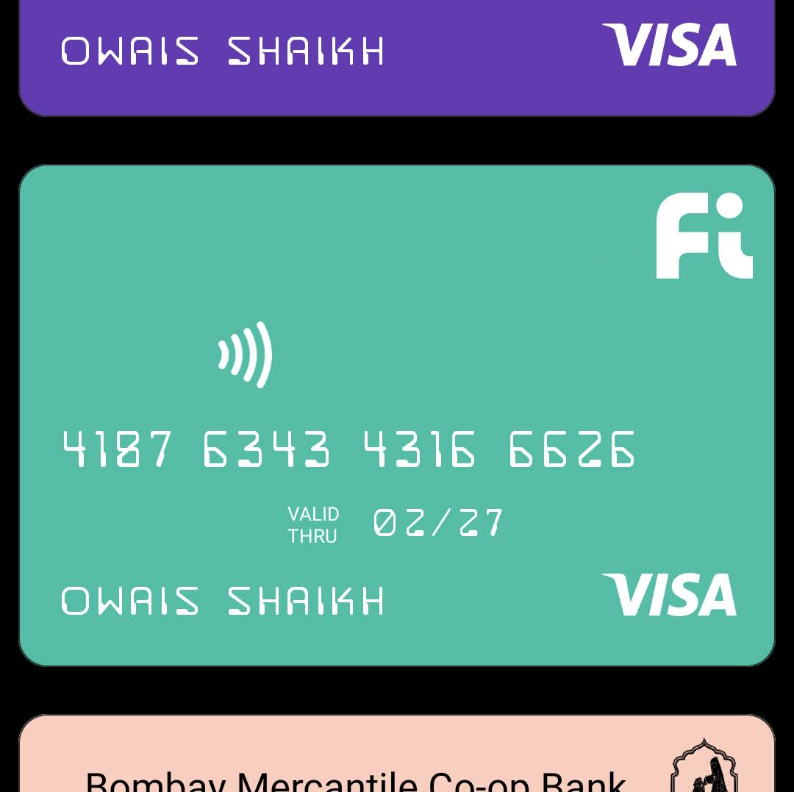
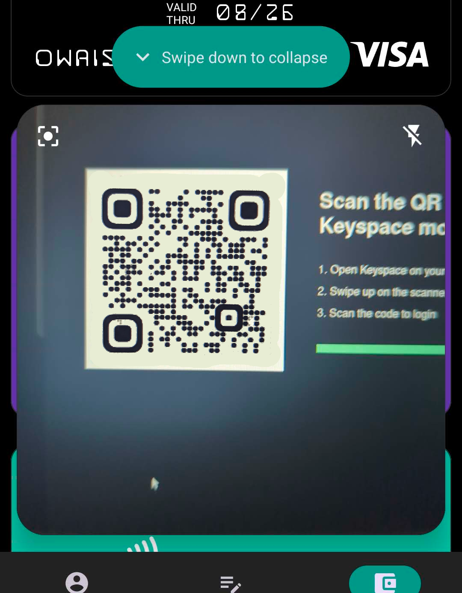
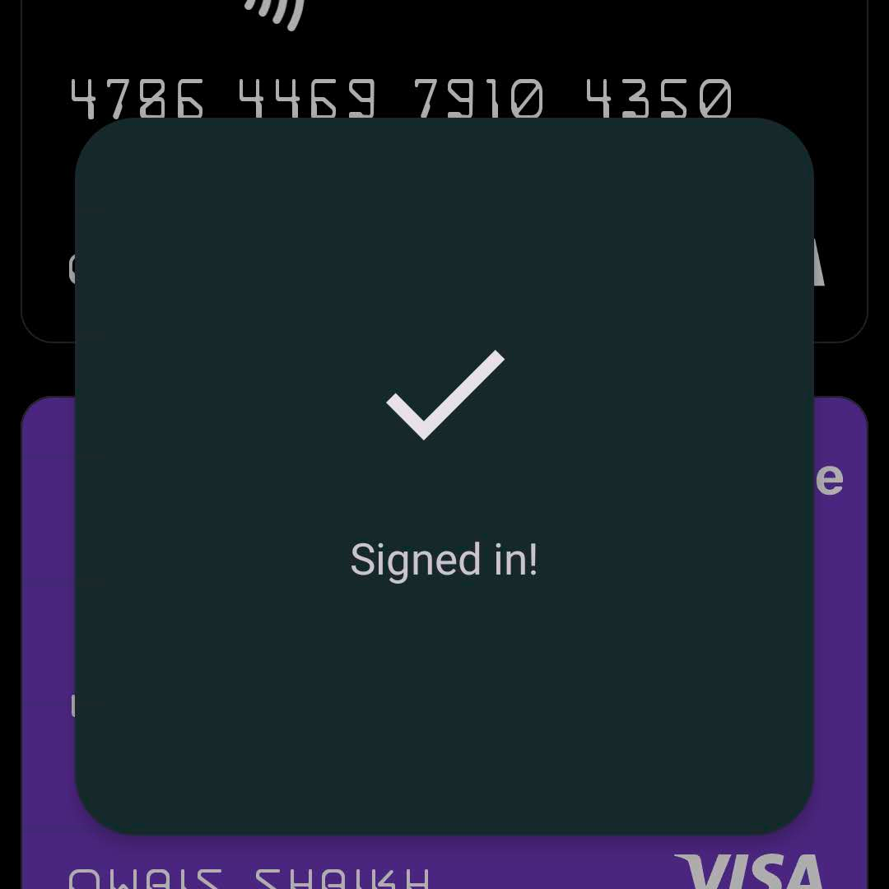
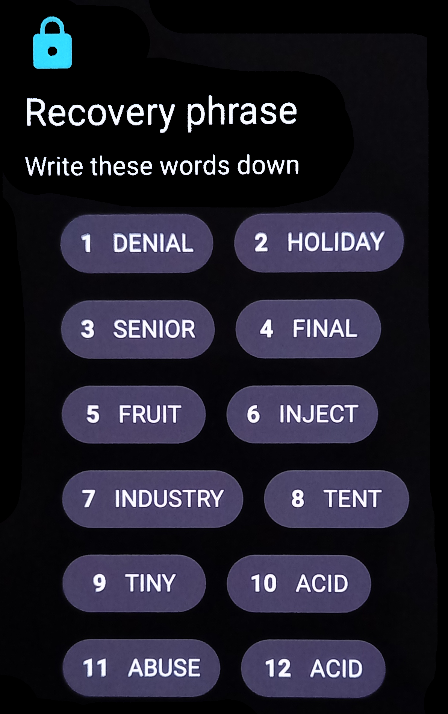

# Keyspace Android

The official Android client for [app.keyspace.cloud](https://app.keyspace.cloud/). A beautiful and secure password manager where you hold the keys safe.

>### Logins
Create and store passwords, two-factor authentication codes, backup codes and more. 

>### Notes
Secure notes with rich previews and markdown support

> ### Payments
Access your credit and debit cards with ease

> ### Keyroute

Swipe up and scan a QR code to instantly log into your desktop
<table align="center" border="0" cellpadding="0" cellspacing="0">
    <thead>
        <tr>
            <td>               </td>
            <td></td>
        </tr>
    </thead>
</table>

> ### Recovery
All of this is backed up and encrypted with a [12 word recovery phrase](https://github.com/bitcoin/bips/blob/master/bip-0039.mediawiki).

_________________

## Features

### Zero knowledge Encryption

Keyspace uses end-to-end encryption to secure all user data (Logins, Notes, Cards etc.) with keys derived from a 12 word mnemonic seed phrase.

### Signature based authentication scheme

_Read more: [Bitwarden Security White Paper (page 9)](https://bitwarden.com/images/resources/security-white-paper-download.pdf)_

Most password managers transmit a hash of users master password for authentication purposes. <strong>Keyspace uses a challenge-response based authentication scheme to eliminate users master password hashes being stored on the backend.</strong> The client simply signs cryptographic challenge and sends it to the backend. Password hashes never cross the wire.

### Deterministic Key derivation

Most cloud based password managers derive a master key that encrypts other keys which are 'wrapped' or 'protected' which is then [stored on their servers](https://bitwarden.com/images/resources/security-white-paper-download.pdf). Keyspace derives all keys deterministically on your device from the 12 word mnemonic seed phrase eliminating the need for 'wrapped' keys. 

### Private

_Read more: [Bitwarden Icon Privacy](https://github.com/bitwarden/mobile/issues/2087)_

Your privacy matters. No [third party analytics or crashlytics](https://www.androidpolice.com/2021/02/26/lastpass-analytics-code-raises-questions-about-potential-security-issues/) libraries were used in the making of Keyspace. 
No network calls are made to external endpoints to [fetch item icons](https://bitwarden.com/help/website-icons/). 

### Stronger and faster cryptography

[XChaCha20-Poly1305 with 192bit nonce](https://en.wikipedia.org/wiki/ChaCha20-Poly1305#XChaCha20-Poly1305_%E2%80%93_extended_nonce_variant) instead of AES256 [GCM](https://doc.libsodium.org/secret-key_cryptography/aead/aes-256-gcm#warning) or [CBC](https://alicegg.tech/2019/06/23/aes-cbc.html) and ED25519 over [RSA](https://leanpub.com/gocrypto/read#leanpub-auto-ed25519) for signatures.

### Strongbox-backed Android Keystore

Your encryption key is stored on a separate [hardware security module (HSM)](https://developer.android.com/training/articles/keystore#HardwareSecurityModule) inside your phone which has its own CPU, storage and RNG, safeguarded against key extraction. Keys are only accessible upon successful device authentication.

### Quick wipe

Instantly sign out and delete all on-device Keyspace data by tapping the quick settings tile. Useful if the country you're in has a poor human rights record or [if your device is confiscated without your consent](https://www.dailydot.com/debug/greenwald-partner-david-miranda-detained-airport/).

### Offline support

On a flight? No problem. <strong>Keyspace can do everything offline and sync once you're online.</strong>

### Native android app

Keyspace is written in Kotlin. Keyspace is designed to be fast and lightweight in size <20MB.

#### Note: Strongbox-backing depends on availability of device-specific hardware. Keyspace will use other secure methods in case your device has no Strongbox.

## Cryptography

- [XChaCha20-Poly1305](https://doc.libsodium.org/secret-key_cryptography/aead/chacha20-poly1305/xchacha20-poly1305_construction)
- [Ed25519](https://doc.libsodium.org/secret-key_cryptography/aead/chacha20-poly1305/xchacha20-poly1305_construction)
- [X25519](https://doc.libsodium.org/key_exchange#usage)
- [PBKDF2](https://github.com/bitcoin/bips/blob/master/bip-0039.mediawiki#from-mnemonic-to-seed)
- [BLAKE2B](https://doc.libsodium.org/key_derivation#deriving-keys-from-a-single-high-entropy-key)

## Credits

### The Keyspace Team

- [**Owais Shaikh**](https://github.com/4f77616973) - Android App
- [**Nimish Karmali**](https://github.com/nimish-ks)- Cryptography, Architecture and Infrastructure
- [**Rohan Chaturvedi**](https://github.com/rohan-keyspace) - Backend API, Browser and Desktop Apps

## License

[Copyright © 2022-2023 Keyspace](LICENSE)

This project is licensed under the GNU GPLv3 License
